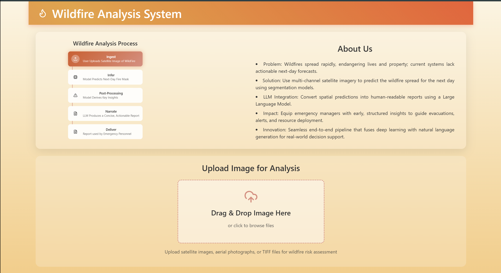
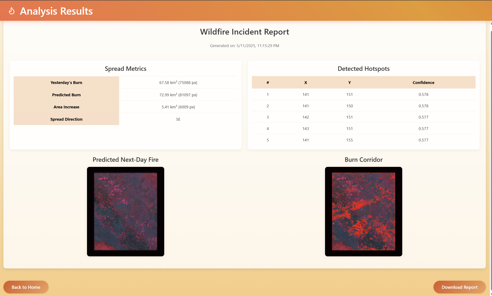
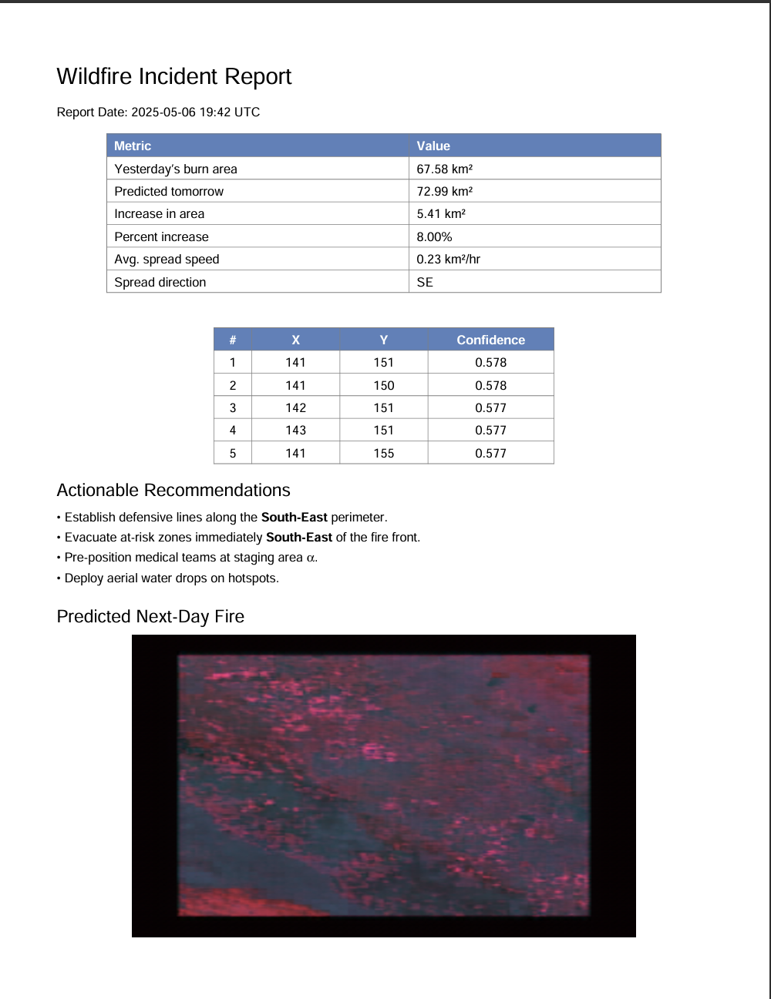

# 🔥 Agni Intel – Wildfire Spread Forecasting & Reporting System

**Agni Intel** is an AI-powered wildfire analysis system that predicts **next-day fire spread** using multi-channel satellite imagery and generates **actionable incident reports** using a large language model (LLM). It is designed to assist emergency responders with accurate, interpretable, and timely decision-making.

---

## 🚨 Motivation

Wildfires in the U.S. burn **over 7 million acres annually**, endangering ecosystems, infrastructure, and human lives. While thermal detection tools like FIRMS exist, they only provide **current fire locations**, not **future spread** or **actionable planning insights**.

**Agni Intel bridges this gap** by combining:
- Transformer-based deep learning for **pixel-level fire spread forecasting**
- Post-processing for **burn area, spread direction, and hotspot extraction**
- LLM-powered **natural language summaries** of fire threat intelligence

---

## 🧠 Core Features

### 🔄 Wildfire Analysis Pipeline
| Stage         | Description                                                  |
|---------------|--------------------------------------------------------------|
| **Ingest**    | User uploads satellite `.npy` file of wildfire image (23 bands) |
| **Infer**     | Swin-Unet V2 predicts next-day fire mask                     |
| **Process**   | Computes burn area, direction, and hotspot coordinates       |
| **Narrate**   | Mistral-7B generates a concise, structured incident report   |
| **Deliver**   | Output presented on UI + downloadable PDF for responders     |

---

## 🖥️ User Interface Preview

### 📌 Upload & Analyze


### 📈 Spread Metrics, Hotspots, Predicted Fire vs Burn Corridor


### 📄 Download report



---

## 📊 Key Outputs

- **Burn Area Comparison**: Predicts area increase in km²
- **Hotspot Detection**: Top-k fire-prone regions with coordinates and confidence
- **Directional Spread**: Derived from centroid shift across time
- **PDF Incident Report**: LLM-generated action plan for field responders

## 🛰️ Dataset

We use the **WildFireSpreadTS** dataset (2018–2021), which includes:

- **13,000+ samples** from active wildfire regions in the western U.S.
- **23-channel daily satellite images** including:
  - Fire, smoke, and thermal signatures
  - Vegetation and land surface indices
  - Weather data (wind, temp)
- Uniform 375m resolution, resampled and center-cropped to `351×303`

---

## 🧬 Model Architecture

### 🔹 Swin-Unet V2
- **Input:** 23-channel satellite images  
- **Output:** 23-band predicted image + fire segmentation mask (via threshold)
- **Backbone:** Pretrained `SwinV2-S` Transformer (ImageNet-1K)

### 🔹 Mistral-7B (LLM)
- Used to generate the final **markdown-style wildfire report**
- Quantized with **8-bit inference** using `bitsandbytes` for fast, GPU-efficient generation
- Prompted with precomputed metrics only (no hallucination risk)

---

## ⚙️ Tech Stack

| Component       | Technology Used                |
|----------------|--------------------------------|
| Frontend        | React + Tailwind CSS           |
| Backend         | FastAPI                        |
| ML Model        | PyTorch + Swin-Unet V2         |
| Report Gen      | Hugging Face Transformers (Mistral-7B) |
| Deployment      | Uvicorn + Docker-ready         |

---

## Results

| Metric          | Value                          |
|-----------------|--------------------------------|
| Accuracy        | 0.9185                         |
| F1 Score        | 0.9461                         |
| IoU             | 0.8977                         |
| Precision       | 0.8978                         |
| Recall          | 0.9888                         |

---

## 🚀 Getting Started

```bash
# Clone the repo
git clone https://github.com/sweta-sahu/next-day-wildfire-spread-prediction-and-reporting.git
cd next-day-wildfire-spread-prediction-and-reporting

# Download model weights
https://drive.google.com/file/d/1_yxkVRgIky40TGuoT6pOQN4DJUbeHOgd/view?usp=drive_link

# Run FastAPI backend
uvicorn app.main:app --reload

# Launch frontend (in /frontend folder)
npm install && npm run dev
```

---

## 📚 References

- WildFireSpreadTS Dataset – https://zenodo.org/records/8006177

- Swin-Unet V2 – https://github.com/chaineypung/Pytorch-Swin-Unet-V2

- Mistral-7B LLM – https://huggingface.co/mistralai/Mistral-7B-Instruct-v0.2

- LLM Quantization – https://huggingface.co/docs/transformers/main/en/quantization

---

## 🧑‍🤝‍🧑 Team

- Prajakta Patil – [ppatil23@buffalo.edu](mailto:ppatil23@buffalo.edu)

- Sweta Sahu – [swetasah@buffalo.edu](mailto:swetasah@buffalo.edu)

- Anchal Daga – [anchalda@buffalo.edu](mailto:anchalda@buffalo.edu)